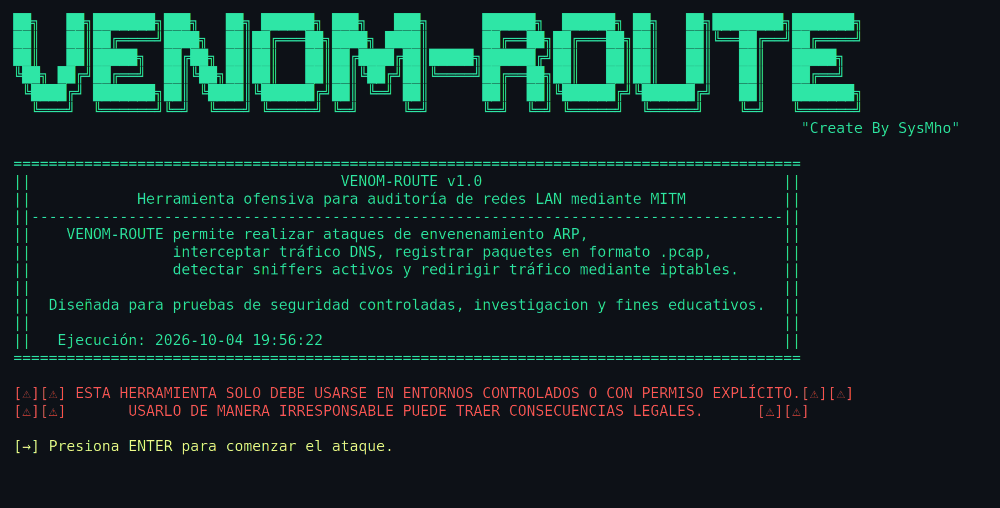

# VENOM-ROUTE

> Herramienta CLI de auditoría de redes LAN mediante ataques MITM (Man-in-the-Middle) usando ARP spoofing.
> 
> Motor Python puro: captura de tráfico clasificada por protocolo, detección pasiva de sniffers, logging de funcionamiento y gestión automática de iptables.


[](LICENSE)

---




> Banner de arranque de la herramienta (animación real de la pantalla inicial).

---

## Tabla de Contenidos

- [¿Qué es Venom-Route?](#qué-es-venom-route)
- [Requisitos Previos](#requisitos-previos)
- [Instalación](#instalación)
- [Uso Rápido](#uso-rápido)
- [Evidencia Generada](#evidencia-generada)
- [Documentación](#documentación)
- [Arquitectura](#arquitectura)
- [Casos de Uso Típicos](#casos-de-uso-típicos)
- [Análisis de Evidencia](#análisis-de-evidencia)
- [Flujo de Ejecución](#flujo-de-ejecución)
- [Buenas Prácticas](#buenas-prácticas)
- [Seguridad](#seguridad)
- [Aviso Legal](#aviso-legal)
- [Licencia](#licencia)
- [Autor](#autor)
- [Historial de Versiones](#historial-de-versiones)

---

## ¿Qué es Venom-Route?

**Venom-Route** es una herramienta de auditoría diseñada para redes LAN autorizadas. Se posiciona lógicamente entre una víctima y su gateway mediante ARP spoofing, permitiendo:

- ✅ Interceptar y clasificar tráfico de red por protocolo (DNS, HTTP, FTP, SMTP, etc.)
- ✅ Capturar evidencia forense (.pcap, .txt) con verificación de integridad (SHA-256)
- ✅ Detectar de forma pasiva hosts en modo promiscuo (sniffers activos en la red)
- ✅ Redirigir tráfico de forma controlada mediante reglas de iptables (NAT/MASQUERADE)
- ✅ Registrar el ciclo de vida completo del motor (arranque, ataque, limpieza)
- ✅ Generar evidencia auditable para informes de seguridad

**Toda la evidencia se guarda como archivos locales** — sin base de datos ni dependencias externas de persistencia.

## Requisitos Previos

### Sistema
- **Linux** (Debian/Ubuntu/Kali probado)
- **Privilegios root** (`sudo`) — obligatorio
- Acceso físico o lógico a la red LAN objetivo (mismo segmento que víctima y gateway)

### Software
- **Python 3.12+** y `pip`
- **arp-scan** — escaneo ARP de la red (usado en el modo interactivo)
- Dependencias Python: **scapy** y **netifaces** (ver [`requirements.txt`](requirements.txt))

> Los comandos para instalar todo esto están en la sección [Instalación](#instalación).

### Autorización
**Requiere permiso explícito por escrito.** El uso no autorizado contra redes de terceros es ilegal en la mayoría de jurisdicciones.

---

## Instalación

```bash
# 1) Clonar el repositorio
git clone https://github.com/Anderson-029/SysMho_Venom.git
cd SysMho_Venom

# 2) Dependencias del sistema (Python + arp-scan)
sudo apt install python3 python3-pip arp-scan

# 3) Dependencias Python
pip install -r requirements.txt
```

---

## Uso Rápido

> **Ejecutar siempre desde dentro de `code/`** (`cd code` primero). Los módulos
> guardan la evidencia en rutas relativas al directorio de trabajo
> (`logs/`, `archivos_unicos/`, `sniff_detection/`), no relativas a dónde
> está el script — si lo lanzas desde la raíz del repo con `code/venom_route.py`,
> las carpetas de evidencia se crean en la raíz en vez de dentro de `code/`.

### Modo Interactivo (Recomendado para principiantes)
```bash
cd code
sudo python3 venom_route.py -I
```
El programa detectará interfaces, escaneará la red y te permitirá elegir víctima/gateway de forma guiada.

### Modo Avanzado (Scripts/Automatización)
```bash
cd code

# Ataque básico
sudo python3 venom_route.py 192.168.1.10 192.168.1.1 eth0

# Con reenvío IP + NAT (mantiene conectividad de la víctima)
sudo python3 venom_route.py 192.168.1.10 192.168.1.1 eth0 -F -M

# Con detección de sniffers
sudo python3 venom_route.py 192.168.1.10 192.168.1.1 eth0 -F -M -A
```

### Limpiar Evidencia Capturada
```bash
cd code
sudo python3 limpiar_logs.py
```
Borra todo el contenido de `logs/`, `archivos_unicos/` y `sniff_detection/` (sin tocar la estructura de carpetas).

---

## Evidencia Generada

Después de cada sesión, se generan:

```
code/
├── logs/
│   ├── dns/DNS_<timestamp>.pcap + .txt
│   ├── http/HTTP_<timestamp>.pcap + .txt
│   ├── arp/ARP_<timestamp>.pcap + .txt
│   ├── tcp/, udp/, icmp/, ... (otros protocolos capturados)
│   └── venom_engine.log          ← Log de funcionamiento del motor
├── archivos_unicos/
│   ├── captura_total_<timestamp>.pcap   ← Consolidado (fuente de verdad)
│   └── hash_captura_global.txt          ← SHA-256 del pcap
└── sniff_detection/
    └── log.txt                          ← Sniffers detectados
```

- **venom_engine.log**: registro completo del ciclo de vida (arranque, envenenamiento ARP, cambios de iptables, errores, limpieza)
- **captura_total_*.pcap**: todos los paquetes sin filtrar (evidencia íntegra)
- **hash_captura_global.txt**: SHA-256 verificable para auditorías

---

## Documentación

- **[MANUAL.md](MANUAL.md)** — Guía completa (18 secciones): cómo funciona, modos de ejecución, análisis de evidencia, troubleshooting

---

## Arquitectura

| Módulo | Responsabilidad |
|--------|-----------------|
| `venom_route.py` | Orquestación CLI, manejo de SIGINT, flujo principal |
| `arp_utils.py` | ARP spoofing bidireccional + restauración |
| `iptables_utils.py` | IP forwarding, FORWARD policy, MASQUERADE (NAT) |
| `network_utils.py` | Detección de interfaces, escaneo ARP, validación de conectividad |
| `sniffer_engine.py` | Captura, clasificación y guardado de tráfico por protocolo |
| `anti_sniff_detector.py` | Detección pasiva de sniffers en modo promiscuo |
| `sniffer_utils.py` | Hash SHA-256, filtro de dominios DNS |
| `ui_utils.py` | Banner, colores, prompts interactivos, validación de root |
| `venom_logger.py` | Log centralizado de funcionamiento (singleton pattern) |
| `limpiar_logs.py` | Utilidad de mantenimiento |

---

## Casos de Uso Típicos

> Todos los comandos siguientes se ejecutan desde `code/` (`cd code` primero).

### 1. Auditar credenciales en texto plano
```bash
sudo python3 venom_route.py 192.168.1.15 192.168.1.1 eth0 -F -M
```
Deja capturando mientras el objetivo usa FTP/Telnet/HTTP sin TLS. Revisa `logs/ftp/`, `logs/telnet/`, `logs/http/` después.

### 2. Verificar resolución de DNS sospechosa
```bash
sudo python3 venom_route.py -I
```
Analiza `logs/dns/*.txt` para ver a qué dominios resuelve el objetivo.

### 3. Detectar sniffers no autorizados en la red
```bash
sudo python3 venom_route.py -I
# Responder "sí" a la pregunta de detección de sniffers
```

### 4. Generar evidencia auditable para un informe
El pcap consolidado (`captura_total_<timestamp>.pcap`) se acompaña de su hash SHA-256 verificable en `hash_captura_global.txt`. Los pcap por protocolo (`logs/<proto>/`) no llevan `.sha256` individual.

---

## Análisis de Evidencia

> Comandos ejecutados desde la raíz del repo (`cd ..` si venías de `code/`).

```bash
# Ver resumen de paquetes capturados
cat code/logs/dns/DNS_20260827_091326.txt

# Abrir pcap en Wireshark
wireshark code/archivos_unicos/captura_total_20260827_091326.pcap

# Verificar integridad del pcap global
sha256sum code/archivos_unicos/captura_total_20260827_091326.pcap
cat code/archivos_unicos/hash_captura_global.txt
# Los hashes deben coincidir

# Ver sniffers detectados durante la sesión
cat code/sniff_detection/log.txt

# Ver log de funcionamiento del motor en tiempo real
tail -f code/logs/venom_engine.log
```

---

## Flujo de Ejecución

1. **Arranque**: validación de root, detección de interfaces, validación de conectividad
2. **Preparación**: activación de ip_forward, configuración de iptables (opcional)
3. **Envenenamiento ARP**: hilos bidireccionales víctima ↔ gateway
4. **Sniffing**: captura y clasificación de tráfico por protocolo (5s ciclos)
5. **Anti-sniffer (opcional)**: detección pasiva cada 10s
6. **Monitoreo**: bucle de espera hasta Ctrl+C
7. **Limpieza** (ante Ctrl+C o cualquier error inesperado durante el ataque): restauración
   de ARP, ip_forward, iptables y detección anti-sniffer; luego se espera al hilo del
   sniffer y se guarda toda la evidencia capturada
8. **Finalización**: salida limpia

---


## Buenas Prácticas

- **Siempre** ejecutar con `-F -M` en auditorías reales (mantiene conectividad de la víctima)
- **Detener siempre con Ctrl+C**, nunca `kill -9` (salta la limpieza de ARP e iptables)
- **Documentar cada sesión**: guarda .pcap, .txt y hashes junto con fecha/hora y alcance
- **Verificar integridad**: compara hash SHA-256 antes de presentar evidencia
- **No modificar estructura de carpetas**: otros scripts internos dependen de `logs/`, `archivos_unicos/`, `sniff_detection/`

---

## Seguridad

Venom-Route es una herramienta ofensiva: úsala **solo en redes autorizadas**. La política de uso responsable y el procedimiento para reportar vulnerabilidades del código están en [SECURITY.md](SECURITY.md).

---

## Aviso Legal

**VENOM-ROUTE está diseñado exclusivamente con fines educativos, de investigación y de auditoría de seguridad en entornos controlados con permiso explícito.**

El uso no autorizado de esta herramienta contra redes o sistemas de terceros es **ilegal** y puede acarrear consecuencias legales civiles y penales.

**El autor no asume responsabilidad alguna por el uso indebido de esta herramienta.**

Úsalo solo en tu propia red, laboratorios, o con autorización explícita y documentada del propietario de la red objetivo.

---

## Licencia

Venom-Route se distribuye bajo la **Licencia Pública General de GNU, versión 3 (GPL-3.0)**. El texto completo está en el archivo [LICENSE](LICENSE).

```
Copyright (C) 2026 SysMho

Este programa es software libre: puedes redistribuirlo y/o modificarlo bajo
los términos de la GNU General Public License v3 publicada por la Free
Software Foundation. Se distribuye con la esperanza de que sea útil, pero
SIN NINGUNA GARANTÍA; ni siquiera la garantía implícita de COMERCIABILIDAD
o IDONEIDAD PARA UN PROPÓSITO PARTICULAR. Consulta la GPL-3.0 para más detalles.
```

> La **licencia** (GPL-3.0) regula el *copyright*: quién puede usar, modificar y redistribuir el código, y obliga a conservar la atribución al autor y a mantener abiertos los derivados. El **uso autorizado** de la herramienta se rige además por el [Aviso Legal](#aviso-legal) de arriba — ambos aplican de forma independiente.

---

## Autor

**SysMho**

---

## Historial de Versiones

El historial completo de cambios está en [CHANGELOG.md](CHANGELOG.md), siguiendo el formato [Keep a Changelog](https://keepachangelog.com/es-ES/1.1.0/) y [Versionado Semántico](https://semver.org/lang/es/).
